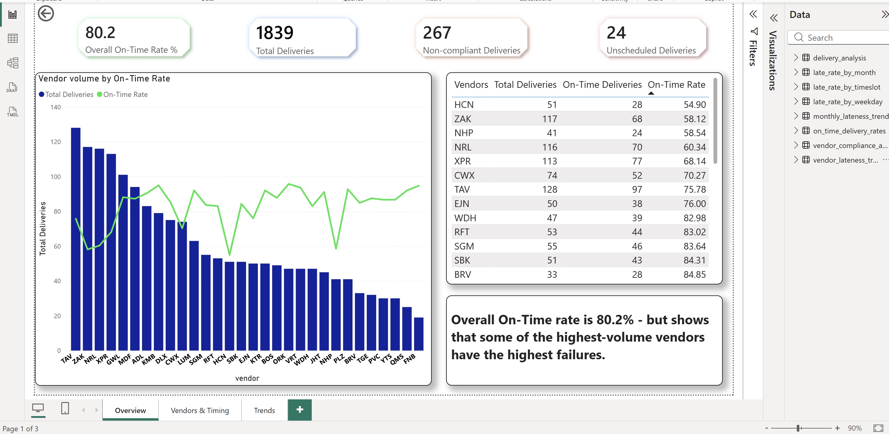
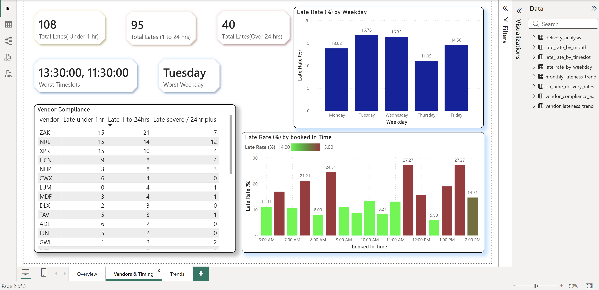
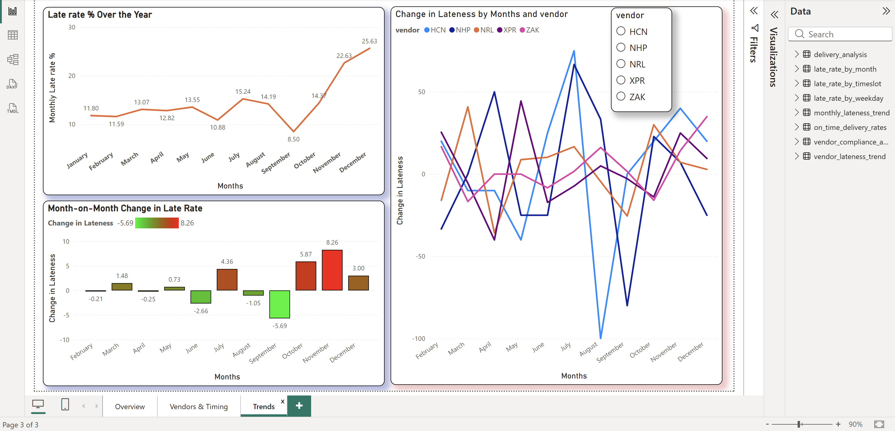

# Vendor Delivery Compliance Analytics

An end-to-end analytics pipeline that turns a messy inbound delivery log into an interactive Power BI dashboard — identifying which vendors fail, when failures cluster, and how compliance trends over the year, so the operation can make evidence-based decisions about which vendors to target, charge, or renegotiate with.

**Pipeline:** Raw inbound log → Python cleaning → SQL analysis (SQLite) → Power BI dashboard.

---

## ⚠️ A note on the data

All data in this project is **synthetic**. Every value was randomly generated and corresponds to **no real vendor, delivery, or record**. The patterns (seasonal Q4 pressure, missing fields, inconsistent entries) are modelled on realistic logistics behaviour and general domain knowledge — **not on any actual company data** — to protect commercial confidentiality while still allowing a full, realistic pipeline to be built and shown. Vendor codes and IDN numbers are fictional.

---

## The problem

Vendors deliver late, and without data it's hard to know *which* vendors to hold accountable, *when* problems concentrate, or whether things are getting better or worse. This project builds a repeatable pipeline that answers those questions, so decisions (targeted conversations, fines, rescheduling) can be justified with evidence rather than gut feel.

## Tools used

- **Python (pandas)** — cleaning and standardising the raw log
- **SQL (SQLite)** — analysis layer: views, CTEs, and window functions
- **Power BI** — the dashboard: KPIs, DAX measures, conditional formatting, slicers

## Pipeline & methodology

**1. Synthetic data generation.** A realistic but fake inbound log (`vendor_inbound_log_2025.xlsx`): most vendors on time or within a grace period, with deliberately missing cells and inconsistent entries to mimic real data entry.

**2. Cleaning (`python/vendor_cleaning_pipeline.py`).** Key decisions:
- Derived a `Booking_type` column from the booked-in time: `Open_slot` (contains "open"), `unscheduled` (blank), else `Fixed`.
- Collapsed all open-slot bookings to a single representative time (15:00) so they don't distort time-of-day analysis.
- Filled identifier gaps meaningfully: missing `IDN` → `No_IDN_provided`, missing `IDN Error` → `none`.
- Filled missing arrival times based on booking type: a booked delivery that never arrived → `Not_arrived` (a genuine no-show); an unscheduled one with no arrival → `Not_scheduled`. This distinction matters analytically — a no-show and a never-booked delivery are different failures.
- Wrote the clean table to SQLite as `Inbound_data`.

**3. Analysis (`sql/vendor_compliance_views.sql`).** Eight re-runnable views built on one foundation view (`delivery_analysis`, which adds a `time_variance` in minutes). Includes a CTE feeding a `LAG` window function to measure each vendor's month-over-month change. Views answer five business questions: worst vendors by on-time rate, compliance breakdown by severity, lateness by weekday / month / time slot, per-vendor momentum, and overall operational trend.

**4. Dashboard (`powerbi/Vendor_Compliance_Dashboard.pbix`).** Three pages — Overview (the "what"), Vendors & Timing (the "who" and "when"), Trends (the "where it's heading").

> **Deployment note:** SQLite + CSV export were used here for speed and zero setup. In production this pipeline would sit on a server database (SQL Server / Postgres) with Power BI connected live — Import mode with scheduled refresh, or DirectQuery for real-time — through an on-premises data gateway.

## Repository structure

```
vendor-compliance-analytics/
├── README.md
├── FINDINGS.md                          # full written analysis of each dashboard page
├── data/
│   ├── vendor_inbound_log_2025.xlsx     # synthetic raw data
│   └── *.csv                            # SQL views exported for Power BI
├── python/
│   └── vendor_cleaning_pipeline.py
├── sql/
│   └── vendor_compliance_views.sql
└── powerbi/
    ├── Vendor_Compliance_Dashboard.pbix
    ├── 01_overview.png
    ├── 02_vendors_timing.png
    └── 03_trends.png
```

## Dashboard

**Page 1 — Overview** (overall rates, vendor volume vs on-time, scorecard)


**Page 2 — Vendors & Timing** (severity breakdown, worst vendors, worst days and slots)


**Page 3 — Trends** (monthly late rate, month-on-month momentum, per-vendor trajectories)


## Key findings

Across 30 vendors and 1,839 deliveries, the overall on-time rate is **80.2%** (267 non-compliant).

- **Non-compliance is concentrated.** Five vendors — NRL, ZAK, XPR, HCN, NHP — account for **75% of the most severe (24hr+) lates** and appear in the top 5 of every severity band. This makes targeting clear.
- **The booking process is a bigger problem than the vendors in one case:** every **unscheduled** delivery is non-compliant (100%) — a process gap, not a vendor fault.
- **Timing patterns:** lateness is worst on **Tuesdays**, and the worst fixed booking slots are **11:30** and **13:30**.
- **Seasonal deterioration:** the late rate climbs sharply through Q4 (**14.4% in October → 25.6% in December**) — and notably, delivery volume stays roughly flat across the year, so the Q4 decline isn't volume-driven, pointing to seasonal pressure on vendors. Q4 is also the industry's peak demand period (Black Friday, Christmas), so compliance is weakest exactly when it's most costly.

Full page-by-page analysis in [`FINDINGS.md`](FINDINGS.md).

## Limitations & future work

- **Synthetic data** — patterns are realistic but not real; findings illustrate the pipeline, not actual vendor performance.
- **Static snapshot** — CSV export rather than a live database connection (see deployment note above).
- **Per-vendor monthly trends are noisy** — individual vendors have few deliveries per month, so their month-to-month rates swing widely. That view is exploratory and reliable only for high-volume vendors.
- **Untested hypotheses** — e.g. whether moving unreliable vendors to open-slot bookings improves their on-time rate (open slots were excluded from timing analysis, so this isn't yet evidenced).
- **Future features** — add vendor **distance/region** to test whether location predicts lateness; test open vs fixed slot performance; a day × time heatmap once data volume supports it.

## Skills demonstrated

Data cleaning and standardisation (pandas) · SQL modelling with views, CTEs and window functions · DAX measures and conditional formatting in Power BI · dashboard design for stakeholders · and data-governance awareness (building on synthetic data to protect confidentiality).
